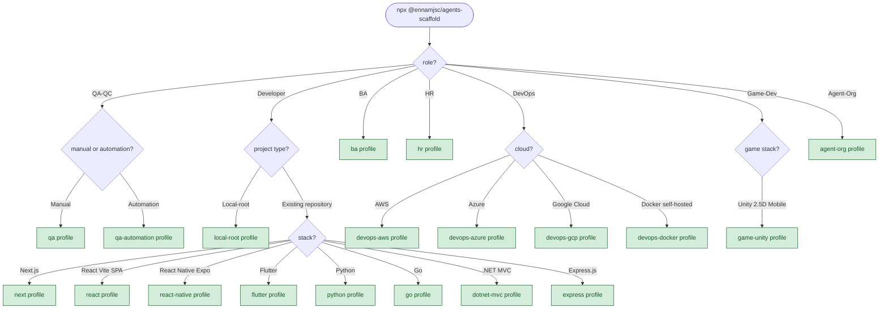

<div align="center">

# 🪄 @ennamjsc/agents-scaffold

### *One `npx` and your repo grows a brain, a memory, and a small army of agents.*

[](https://www.npmjs.com/package/@ennamjsc/agents-scaffold)
[](https://www.npmjs.com/package/@ennamjsc/agents-scaffold)
[](https://nodejs.org)
[](https://github.com/En-Nam/ennam-agents-scaffold/actions/workflows/publish.yml)
[](https://github.com/En-Nam/ennam-agents-scaffold/stargazers)
[](#license)

</div>

> **⭐ Current star count: 3.** Yes, *three* whole humans looked at this repo and thought "you know what, I want to find this again." One of them might be a maintainer. We don't ask questions. If you're reading this and own a mouse, the [☆ button](https://github.com/En-Nam/ennam-agents-scaffold/stargazers) is *right there* and it costs nothing but a dopamine hit. The badge above updates live — help us make it lie less.

Install Claude Code tooling (Superpowers workflow + Serena memories + role agents + MCP servers) into an existing project — **without touching a single line of your application code.** It's like a personality transplant for your repo, except reversible and backed up to `.ennam-scaffold-backup/`.

**Why?** Because setting all of this up by hand is a full afternoon of copy-pasting YAML and questioning your career. This does it in the time it takes to say "wait, was that supposed to prompt me?"

## Quickstart

Option 1 — guided wizard (recommended). Walks you through role → project type → stack:

```bash
cd <target>
npx @ennamjsc/agents-scaffold
```

For application repos, point `<target>` at the repo root. For the orchestration root (`local-root` profile), point at an empty directory.

Option 2 — install a profile directly (skips the wizard):

```bash
cd <target>
npx @ennamjsc/agents-scaffold <profile>
```

### Install flow



> The diagram above renders on GitHub. On npmjs.com, the mermaid code block is shown verbatim — open this README on GitHub for the rendered flowchart.

## Profiles

### Developer (stack-specific)

| Profile | Stack | Extra MCP |
|---|---|---|
| `next` | Next.js 16 + React 19 + TS strict + Tailwind 4 | figma |
| `react` | React 19 SPA — Vite 6 + React Router 7 + TanStack Query + shadcn/ui + Tailwind 4 + Vitest | figma |
| `react-native` | React Native 0.76+ (New Architecture) + Expo SDK 52+ + Expo Router + NativeWind + Reanimated 3 + Maestro | figma |
| `flutter` | Flutter 3.x + Dart + Riverpod/Bloc | figma |
| `python` | Python 3.12 + FastAPI + uv + ruff + pytest | — |
| `go` | Go 1.24 + stdlib net/http + pgx + slog | — |
| `dotnet-mvc` | .NET 9 + ASP.NET Core MVC + EF Core 9 + xUnit | postgres, github |
| `express` | Node 20 + Express 5 + TypeScript strict + Jest + Zod | github |

### QA / BA / HR (role-specific, no stack branch)

| Profile | Role | Extra MCP |
|---|---|---|
| `qa` | QA workflow (test-cases + evidence + `/qa-run` `/qa-report`) | — |
| `qa-automation` | QA Automation — Maestro (mobile) + Playwright (web) + Gherkin BDD parser; 3 skills (`qa-maestro`, `qa-playwright`, `gherkin-bdd`) | — |
| `ba` | Business Analyst — user stories + Gherkin AC + BPMN flows + `/ba-story` `/ba-flow` | — |
| `hr` | HR — JD authoring + interview kits + `/hr-jd` `/hr-interview-kit` | — |

### DevOps (cloud / infra-target-specific)

| Profile | Stack | Extra MCP |
|---|---|---|
| `devops-aws` | Terraform + AWS (ECS, RDS, IAM, Secrets Manager, CloudWatch) | github |
| `devops-azure` | Bicep/Terraform + Azure (AKS, App Service, Key Vault, Log Analytics) | github |
| `devops-gcp` | Terraform + GCP (GKE, Cloud Run, Cloud SQL, Secret Manager, Cloud Logging) | github |
| `devops-docker` | Self-hosted Docker fleet — Komodo (GitOps Resource Sync + RBAC + audit) + Tecnativa socket-proxy + Tailscale sidecar + Dozzle + cAdvisor/Prometheus/Grafana + Uptime Kuma + Diun + Renovate | github |

### Game-Dev (engine-specific)

| Profile | Stack | Extra MCP |
|---|---|---|
| `game-unity` | Unity 6.5 (URP mobile, 2.5D) + Cinemachine 3.x + CoplayDev Unity MCP v9.7.3 + Tripo3D 3D asset gen (`--dry-run` default, `--provider meshy` opt-in fallback) + Git LFS | unity (CoplayDev) |

### Orchestration

| Profile | Purpose | Extra MCP | Requires Claude Code |
|---|---|---|---|
| `local-root` | Polyrepo coordinator — reads sub-platform `.serena/` memories | — | any |
| `agent-org` | Multi-agent dispatch — orchestrator + implementer + reviewer + SubagentStop hook. Cost-heavy; opt-in. | — | **>= 2.1.178** |

All profiles also register `serena`, `context7`, and `jira` via the shared MCP partial. The `Extra MCP` column lists only the profile-specific additions on top of that base. (`game-unity`'s Unity MCP comes via its own `.mcp.json.partial.hbs`, not the shared catalog.)

Each role/cloud profile ships with its own `.claude/agents/<specialist>.md`, one or two `.claude/commands/<verb>.md` slash commands, and one or two `.claude/skills/<topic>/SKILL.md` skills that auto-load when the topic comes up in conversation. `game-unity` is the first profile to ship 3 agents + 3 commands + 4 skills (rationale: game-dev domain rạch ròi between gameplay code / asset pipeline / build-and-test; each agent has explicit "When NOT" boundaries).

## What gets added

- `AGENTS.md` — 13 universal behavioral rules
- `CLAUDE.md` — appended scaffold-managed block (with markers, idempotent on re-run)
- `.claude/` — settings, hooks, slash commands (`/boot`, `/checkpoint`, `/memory`, `/escalate`), role agents
- `.mcp.json` — deep-merged with any existing config (user wins on conflicts)
- `.serena/` — memories skeleton + checkpoint folder
- `docs/superpowers/` — empty specs and plans folders
- `.gitignore` — append-only with dedup (no duplicates on re-run)

Each merge backs up the original to `.ennam-scaffold-backup/<timestamp>/`. Backups rotate to the 3 most recent.

### No-repo behavior

When the target directory does not contain a `.git` directory, the scaffold silently skips the `.gitignore` append step for ALL profiles. Every other file is still written. To enable `.gitignore` handling, run `git init` first. This requires no flags.

### Claude for Chrome integration

Browser-side debugging and UI verification are handled by the [Claude for Chrome](https://www.anthropic.com/news/claude-for-chrome) extension, not by an MCP server. Install the extension separately; the scaffold's `next` and `qa` profiles reference it from their CLAUDE.md partials. There is no `.mcp.json` entry to add — Claude for Chrome is a browser extension, not an MCP.

### Upgrading from v1.1

v1.2 removed the `chrome-devtools` MCP server in favour of the Claude for Chrome extension (above). If your project already has `mcpServers.chrome-devtools` in its `.mcp.json` from a prior install, remove that entry manually — the merge is user-wins on conflicts, so re-running the scaffold will not delete it. The CLI prints a warning after install when it detects a stale entry.

### Upgrading from v1.2

v1.3 fixes a silent-exit bug under `npx`: pre-1.3 invocations would print nothing and exit 0 without scaffolding anything because the entry-point guard compared the symlinked bin path against the realpath of the module. If `npx @ennamjsc/agents-scaffold` worked silently for you on v1.2, upgrading to v1.3 will make it actually run. v1.3 also adds 7 new profiles (`dotnet-mvc`, `express`, `ba`, `hr`, `devops-aws`, `devops-azure`, `devops-gcp`) and three new wizard roles (BA, HR, DevOps with cloud branch). No existing profile names changed — existing pin-by-name calls (`npx ... next`, `npx ... qa`, etc.) keep working.

### Upgrading from v1.3

v1.4 adds two Developer stacks: `react` (Vite SPA — React 19 + React Router 7 + TanStack Query + Tailwind 4 + Vitest) and `react-native` (Expo SDK 52+ on the New Architecture, Expo Router, NativeWind, Reanimated 3, Maestro for E2E). All profile-specific agent and skill prompts were audited against current Anthropic subagent guidance — most were already compliant; a handful received surgical edits. No profile names changed; no behavior changed for existing installs.

### Upgrading from v1.5.0 → v1.5.1

v1.5.1 fixes two broken shapes the scaffold has been shipping in `.claude/settings.json` since v1.0:

1. `permissions.additionalAllowList` (legacy key Claude Code silently ignores) → corrected to `permissions.allow`. Net effect for upgraders: your auto-allow rules for `Bash(npm:*)` / `Bash(git:*)` etc. were never in effect — they will be once you re-run or migrate manually.
2. `hooks.SessionStart` entries used the legacy bare `{command}` shape. Current Claude Code rejects this with **"Expected array, but received undefined"** and refuses to load any settings from the file. Corrected to the required nested `{hooks: [{type: "command", command: "…"}]}` wrapper.

Because `.claude/settings.json` is merged user-wins on arrays, **re-running the scaffold cannot auto-rewrite an existing broken file** — the CLI now prints a loud warning at the end of every install when it detects either legacy shape so you know to fix it by hand.

### Upgrading from v1.8

v1.9 adds two new profiles + one preflight flag + one preflight field:

- **`qa-automation` profile** — QA Automation Engineer with 3 skills (`qa-maestro` for Maestro mobile flows, `qa-playwright` for Playwright web specs, `gherkin-bdd` as shared parser). The wizard now branches under **QA-QC → Manual or Automation?** — the existing `qa` (manual) path is unchanged. `qa-automation` references (does NOT duplicate) the Maestro install from the `react-native` profile — install order is user's discretion, but if `react-native` owns `.maestro/config.yaml`, this profile only authors under `.maestro/flows/**`. Web team convention: **NO `.feature` files for web** — BDD scenarios live as JSDoc header blocks at the top of each spec file (see [`templates/qa-automation/.claude/skills/qa-playwright/SKILL.md`](templates/qa-automation/.claude/skills/qa-playwright/SKILL.md)). Origin: GitHub [issue #2](https://github.com/En-Nam/ennam-agents-scaffold/issues/2).
- **`agent-org` profile** — multi-agent dispatch template. Ships the 3-role trio (`orchestrator` + `implementer` + `reviewer`) as `.claude/agents/*.md.hbs` + a log-only `SubagentStop` hook. Pick from the wizard under **Agent-Org**. **Cost-heavy** (Opus orchestrator + Sonnet workers running concurrently, ~5-10× tokens vs solo) — opt-in only, disclosed in the profile's `CLAUDE.md.partial.hbs`. **Requires Claude Code >= 2.1.178** (post-`TeamCreate`/`TeamDelete` removal + `team_name` deprecation cutline). Known limitation for v1.9: the hook must be registered in `.claude/settings.json` manually after install — `printNextSteps` shows the paste-ready JSON block. Auto-merge of profile-specific hook fragments is tracked as a follow-up for v1.10.x.
- **`--analyze-claude` flag** — Feature A from GitHub [issue #4](https://github.com/En-Nam/ennam-agents-scaffold/issues/4). `npx @ennamjsc/agents-scaffold --analyze-claude` scans `./CLAUDE.md` headings for 12 patterns that commonly overlap with scaffold-managed instructions (`Task Startup Protocol`, `Session Checkpoint Protocol`, `Serena MCP Policy`, `Workflow`, `Verification`, etc.) and prints line-cited warnings. Non-destructive by contract — short-circuits before the wizard. Feature B (`--claude-strategy=minimal`) is deferred to v1.10.
- **`minClaudeCodeVersion` profile field** — new optional field on `ProfileDef`. On install, the wizard runs `claude --version` and WARNS (does not block) if the installed version is behind the profile's requirement. First consumer: `agent-org` (`2.1.178`). Field is stack-agnostic — future profiles depending on experimental Claude Code features can gate the same way.

Meta-spike origin: the `agent-org` pattern was **validated in-place** in this repo by using its 3-role trio + SubagentStop hook to build `qa-automation` end-to-end. See [`.serena/memories/decisions/v1.9-scope.md`](.serena/memories/decisions/v1.9-scope.md) for the R&D verdict and kill criteria.

### Upgrading from v1.7

v1.8 adds the **`game-unity`** profile — a Game-Dev role for Unity 2.5D mobile (URP). Pick from the wizard under **Game-Dev → Unity 2.5D Mobile**.

- **Engine**: Unity 6.5 primary (also supported: 6000.0, 2022.3 LTS, 2021.3 LTS via `--legacy`); URP 17+ mobile renderer asset; Cinemachine 3.x.
- **Unity Editor MCP**: [CoplayDev/unity-mcp](https://github.com/CoplayDev/unity-mcp) v9.7.3 (formerly justinpbarnett/unity-mcp; acquired by Coplay 2025-08). Baked into `.mcp.json.partial.hbs` as `uvx coplay-mcp-server` (Python ≥3.11 + uv required on host).
- **3D asset generation**: [Tripo3D](https://www.tripo3d.ai/) Python SDK (`TripoClient` async API) as default. The `asset-pipeline-tripo3d` skill **defaults to `--dry-run`** — real API calls require explicit `--live` flag + interactive confirmation that **Pro tier ($13.93/mo annual minimum)** is active. Free tier outputs are CC BY 4.0 **NON-COMMERCIAL** — unusable for commercial games. Meshy `--provider meshy` is an opt-in fallback for rigged characters (Meshy's 500+ animation library is the unmatched lead there). NEVER auto-fallback — Rule 12.
- **Sprite AI MCP**: omitted in v1.8.0 — no stable, tokenless option meets bake-in bar. CLAUDE.md points to `pixelforge-mcp` (MIT, Gemini key) + `spritecook-mcp` (paid SaaS). Revisit tracked in [`mem:backlog/sprite-mcp-revisit-v1.8.x`](.serena/memories/backlog/sprite-mcp-revisit-v1.8.x.md).
- **Workflow**: extends the shared 7-phase workflow with **Phase 6 Content Gates** — 4 human sign-off checkboxes in the PR body (Design / Art / Feel / Perf) before Phase 7 begins.
- **Templates emitted**: `GDD.md.hbs`, `art-bible.md.hbs`, `docs/perf-budget.md`, plus 2 Editor C# templates (`EnnamPreflight.cs` asserts Domain Reload disabled + URP mobile compliance; `EnnamPerf.cs` runs ProfilerRecorder harness for `perf-budget-check` skill). Copy the .cs files into your Unity `Assets/Editor/` after install — README in `Editor-templates/` explains why.
- **Git LFS**: new `_shared/.gitattributes.append` ships Unity binary rules (`.fbx .glb .png .psd .wav` etc.). `.unity .prefab .asset .meta` are deliberately NOT LFS — Unity Smart Merge needs text diffs.
- **Wizard**: new top-level role **Game-Dev**; `resolveProfile` gains optional 5th `gameStack` parameter (backward-compatible — all existing call sites unchanged).
- **Pre-publish maintainer gate**: `scripts/verify-game-unity-bake.mjs` runs 5 checks against the live world (`uvx` presence, PyPI `coplay-mcp-server`, Tripo base URL alive, Python SDK `TripoClient.get_balance()` handshake with `TRIPO_API_KEY`, npm `files[]` excludes `scripts/`). Run BEFORE `npm publish` of the scaffold itself; not part of the user-facing flow.

### Upgrading from v1.4

v1.5 adds the `devops-docker` profile — a DevOps role for self-hosted Docker fleets. The recommended stack is **Komodo** (GitOps Resource Sync + RBAC + audit, all free under GPL-3.0) as the management UI, with **Tecnativa docker-socket-proxy** fronting every Docker socket (no raw socket bind anywhere), **Tailscale sidecar pattern** for remote access (one sidecar per exposed service; no public ports), **Dozzle** for log search, **cAdvisor + Prometheus + Grafana** for metrics history, **Uptime Kuma** for alerts, **Diun** for notify-only image updates, and **Renovate** for PR-based image bumps (no Watchtower — archived in 2024). The agent prompt forbids `:latest` tags, raw `/var/run/docker.sock` binds, `privileged: true`, Watchtower/ctop, and Tailscale Funnel for admin UIs. Pick this profile from the wizard under **DevOps → Docker (self-hosted)**.

**New: post-install handoff prompt.** After every interactive install (except `local-root`), the CLI now prints a copy-paste prompt you paste into a fresh `claude` session at the repo. It instructs Claude to fill in your project-specific context — stack, key directories, commands, conventions, hot zones — in the area ABOVE the scaffold-managed marker block in `CLAUDE.md`. The scaffold tool itself only manages the block between the markers; the project-profile area above is yours. The prompt has hard guardrails: it forbids the agent from touching anything between the markers, requires every claim to cite a file the agent actually read, and demands a unified diff + confirmation before writing. The prompt is suppressed under `--no-prompts` (CI mode).

## Flags

| Flag | Effect |
|------|--------|
| `--dry-run` | Print plan, write nothing |
| `--force` | Same as `--merge-strategy=overwrite` |
| `--merge-strategy <s>` | `ask` (default) \| `skip` \| `overwrite` \| `append` \| `json-merge` |
| `--no-prompts` | Fail on missing info (CI mode) |
| `--verbose` | Verbose output |
| `--analyze-claude` | Scan `./CLAUDE.md` for section headers that may overlap with scaffold instructions, print line-cited warnings + recommendation, exit 0. Non-destructive; runs before the wizard/install flow. |

## Manual review after merge

Every merge into an existing file backs up the original to `.ennam-scaffold-backup/<timestamp>/`. If you want to review or hand-edit the merged result:

```bash
diff .ennam-scaffold-backup/<timestamp>/CLAUDE.md ./CLAUDE.md
# edit CLAUDE.md in your IDE
```

There is no interactive editor mode — `git diff` and your IDE give you better tooling than a one-shot `$EDITOR` invocation would.

## Unix users

After install, make the bash hook executable:

```bash
chmod +x .claude/hooks/session-start.sh
```

## Development

```bash
npm install
npm -w @ennamjsc/agents-scaffold run build
npm -w @ennamjsc/agents-scaffold run test
```

See [docs/superpowers/specs/](docs/superpowers/specs/) for design.

## License

Published publicly on npm for `npx` convenience. Internal Ennam Engineering tool; no proprietary content. No formal open-source license yet — treat as "source available, internal use". (Lawyers: it's fine. Everyone else: it's fine.)

---

<div align="center">

**Made with 🤖, ☕, and an unreasonable number of Serena memories.**

If this saved you an afternoon of YAML, consider paying it forward with a ⭐ — [star the repo](https://github.com/En-Nam/ennam-agents-scaffold/stargazers) and watch that badge tick from 3 to a slightly-less-lonely 4.

</div>
