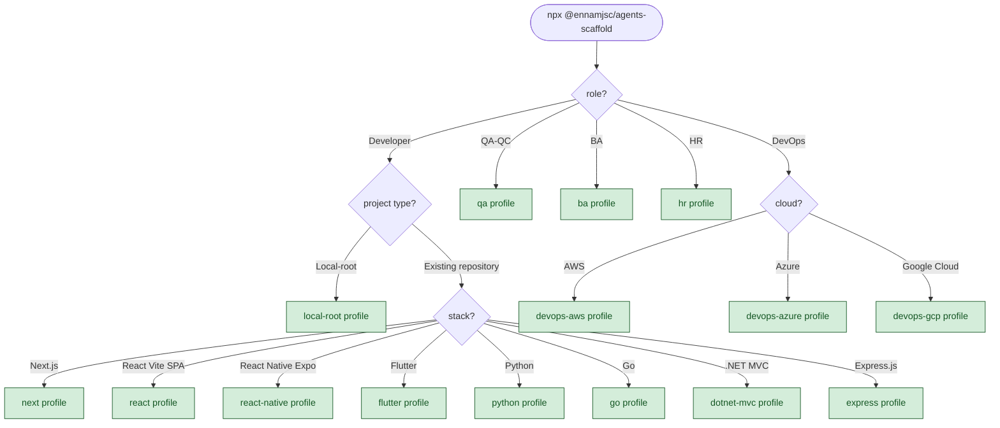

# @ennamjsc/agents-scaffold

[](https://www.npmjs.com/package/@ennamjsc/agents-scaffold)
[](https://nodejs.org)
[](#license)

Install Claude Code tooling (Superpowers workflow + Serena memories + role agents + MCP servers) into an existing project — without touching application code.

## Quickstart

Option 1 — guided wizard (recommended). Walks you through role → project type → stack:

```bash
cd <target>
npx @ennamjsc/agents-scaffold
```

For application repos, point `<target>` at the repo root. For the orchestration root (`local-root` profile), point at an empty directory.

Option 2 — install a profile directly (skips the wizard):

```bash
cd <target>
npx @ennamjsc/agents-scaffold <profile>
```

### Install flow



> The diagram above renders on GitHub. On npmjs.com, the mermaid code block is shown verbatim — open this README on GitHub for the rendered flowchart.

## Profiles

### Developer (stack-specific)

| Profile | Stack | Extra MCP |
|---|---|---|
| `next` | Next.js 16 + React 19 + TS strict + Tailwind 4 | figma |
| `react` | React 19 SPA — Vite 6 + React Router 7 + TanStack Query + shadcn/ui + Tailwind 4 + Vitest | figma |
| `react-native` | React Native 0.76+ (New Architecture) + Expo SDK 52+ + Expo Router + NativeWind + Reanimated 3 + Maestro | figma |
| `flutter` | Flutter 3.x + Dart + Riverpod/Bloc | figma |
| `python` | Python 3.12 + FastAPI + uv + ruff + pytest | — |
| `go` | Go 1.24 + stdlib net/http + pgx + slog | — |
| `dotnet-mvc` | .NET 9 + ASP.NET Core MVC + EF Core 9 + xUnit | postgres, github |
| `express` | Node 20 + Express 5 + TypeScript strict + Jest + Zod | github |

### QA / BA / HR (role-specific, no stack branch)

| Profile | Role | Extra MCP |
|---|---|---|
| `qa` | QA workflow (test-cases + evidence + `/qa-run` `/qa-report`) | — |
| `ba` | Business Analyst — user stories + Gherkin AC + BPMN flows + `/ba-story` `/ba-flow` | — |
| `hr` | HR — JD authoring + interview kits + `/hr-jd` `/hr-interview-kit` | — |

### DevOps (cloud-specific)

| Profile | Cloud / IaC | Extra MCP |
|---|---|---|
| `devops-aws` | Terraform + AWS (ECS, RDS, IAM, Secrets Manager, CloudWatch) | github |
| `devops-azure` | Bicep/Terraform + Azure (AKS, App Service, Key Vault, Log Analytics) | github |
| `devops-gcp` | Terraform + GCP (GKE, Cloud Run, Cloud SQL, Secret Manager, Cloud Logging) | github |

### Orchestration

| Profile | Purpose | Extra MCP |
|---|---|---|
| `local-root` | Polyrepo coordinator — reads sub-platform `.serena/` memories | — |

All profiles also register `serena`, `context7`, and `jira` via the shared MCP partial. The `Extra MCP` column lists only the profile-specific additions on top of that base.

Each role/cloud profile ships with its own `.claude/agents/<specialist>.md`, one or two `.claude/commands/<verb>.md` slash commands, and one or two `.claude/skills/<topic>/SKILL.md` skills that auto-load when the topic comes up in conversation.

## What gets added

- `AGENTS.md` — 13 universal behavioral rules
- `CLAUDE.md` — appended scaffold-managed block (with markers, idempotent on re-run)
- `.claude/` — settings, hooks, slash commands (`/boot`, `/checkpoint`, `/memory`, `/escalate`), role agents
- `.mcp.json` — deep-merged with any existing config (user wins on conflicts)
- `.serena/` — memories skeleton + checkpoint folder
- `docs/superpowers/` — empty specs and plans folders
- `.gitignore` — append-only with dedup (no duplicates on re-run)

Each merge backs up the original to `.ennam-scaffold-backup/<timestamp>/`. Backups rotate to the 3 most recent.

### No-repo behavior

When the target directory does not contain a `.git` directory, the scaffold silently skips the `.gitignore` append step for ALL profiles. Every other file is still written. To enable `.gitignore` handling, run `git init` first. This requires no flags.

### Claude for Chrome integration

Browser-side debugging and UI verification are handled by the [Claude for Chrome](https://www.anthropic.com/news/claude-for-chrome) extension, not by an MCP server. Install the extension separately; the scaffold's `next` and `qa` profiles reference it from their CLAUDE.md partials. There is no `.mcp.json` entry to add — Claude for Chrome is a browser extension, not an MCP.

### Upgrading from v1.1

v1.2 removed the `chrome-devtools` MCP server in favour of the Claude for Chrome extension (above). If your project already has `mcpServers.chrome-devtools` in its `.mcp.json` from a prior install, remove that entry manually — the merge is user-wins on conflicts, so re-running the scaffold will not delete it. The CLI prints a warning after install when it detects a stale entry.

### Upgrading from v1.2

v1.3 fixes a silent-exit bug under `npx`: pre-1.3 invocations would print nothing and exit 0 without scaffolding anything because the entry-point guard compared the symlinked bin path against the realpath of the module. If `npx @ennamjsc/agents-scaffold` worked silently for you on v1.2, upgrading to v1.3 will make it actually run. v1.3 also adds 7 new profiles (`dotnet-mvc`, `express`, `ba`, `hr`, `devops-aws`, `devops-azure`, `devops-gcp`) and three new wizard roles (BA, HR, DevOps with cloud branch). No existing profile names changed — existing pin-by-name calls (`npx ... next`, `npx ... qa`, etc.) keep working.

### Upgrading from v1.3

v1.4 adds two Developer stacks: `react` (Vite SPA — React 19 + React Router 7 + TanStack Query + Tailwind 4 + Vitest) and `react-native` (Expo SDK 52+ on the New Architecture, Expo Router, NativeWind, Reanimated 3, Maestro for E2E). All profile-specific agent and skill prompts were audited against current Anthropic subagent guidance — most were already compliant; a handful received surgical edits. No profile names changed; no behavior changed for existing installs.

**New: post-install handoff prompt.** After every interactive install (except `local-root`), the CLI now prints a copy-paste prompt you paste into a fresh `claude` session at the repo. It instructs Claude to fill in your project-specific context — stack, key directories, commands, conventions, hot zones — in the area ABOVE the scaffold-managed marker block in `CLAUDE.md`. The scaffold tool itself only manages the block between the markers; the project-profile area above is yours. The prompt has hard guardrails: it forbids the agent from touching anything between the markers, requires every claim to cite a file the agent actually read, and demands a unified diff + confirmation before writing. The prompt is suppressed under `--no-prompts` (CI mode).

## Flags

| Flag | Effect |
|------|--------|
| `--dry-run` | Print plan, write nothing |
| `--force` | Same as `--merge-strategy=overwrite` |
| `--merge-strategy <s>` | `ask` (default) \| `skip` \| `overwrite` \| `append` \| `json-merge` |
| `--no-prompts` | Fail on missing info (CI mode) |
| `--verbose` | Verbose output |

## Manual review after merge

Every merge into an existing file backs up the original to `.ennam-scaffold-backup/<timestamp>/`. If you want to review or hand-edit the merged result:

```bash
diff .ennam-scaffold-backup/<timestamp>/CLAUDE.md ./CLAUDE.md
# edit CLAUDE.md in your IDE
```

There is no interactive editor mode — `git diff` and your IDE give you better tooling than a one-shot `$EDITOR` invocation would.

## Unix users

After install, make the bash hook executable:

```bash
chmod +x .claude/hooks/session-start.sh
```

## Development

```bash
npm install
npm -w @ennamjsc/agents-scaffold run build
npm -w @ennamjsc/agents-scaffold run test
```

See [docs/superpowers/specs/](docs/superpowers/specs/) for design.

## License

Published publicly on npm for `npx` convenience. Internal Ennam Engineering tool; no proprietary content. No formal open-source license yet — treat as "source available, internal use".
