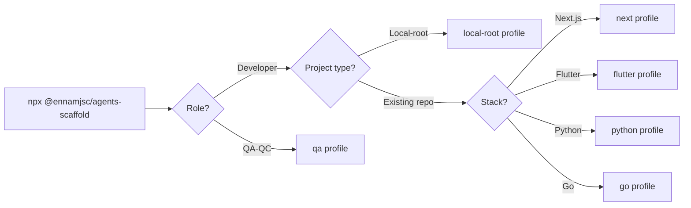

# @ennamjsc/agents-scaffold

[](https://www.npmjs.com/package/@ennamjsc/agents-scaffold)
[](https://nodejs.org)
[](#license)

Install Claude Code tooling (Superpowers workflow + Serena memories + role agents + MCP servers) into an existing project — without touching application code.

## Quickstart

Option 1 — guided wizard (recommended). Walks you through role → project type → stack:

```bash
cd my-project
npx @ennamjsc/agents-scaffold
```

Option 2 — install a profile directly (skips the wizard):

```bash
cd my-project
npx @ennamjsc/agents-scaffold <profile>
```

### Install flow



## Profiles

| Profile | Stack | Extra MCP |
|---|---|---|
| `next` | Next.js 16 + React 19 + TS strict + Tailwind 4 | figma |
| `flutter` | Flutter 3.x + Dart + Riverpod/Bloc | figma |
| `python` | Python 3.12 + FastAPI + uv | — |
| `go` | Go 1.24 + stdlib net/http + pgx | — |
| `qa` | QA workflow (test-cases + evidence) | — |
| `local-root` | Orchestration root — polyrepo coordinator, reads sub-platform `.serena/` memories | — |

## What gets added

- `AGENTS.md` — 13 universal behavioral rules
- `CLAUDE.md` — appended scaffold-managed block (with markers, idempotent on re-run)
- `.claude/` — settings, hooks, slash commands (`/boot`, `/checkpoint`, `/memory`, `/escalate`), role agents
- `.mcp.json` — deep-merged with any existing config (user wins on conflicts)
- `.serena/` — memories skeleton + checkpoint folder
- `docs/superpowers/` — empty specs and plans folders
- `.gitignore` — append-only with dedup (no duplicates on re-run)

Each merge backs up the original to `.ennam-scaffold-backup/<timestamp>/`. Backups rotate to the 3 most recent.

### No-repo behavior

When the target directory does not contain a `.git` directory, the scaffold silently skips the `.gitignore` append step for ALL profiles. Every other file is still written. To enable `.gitignore` handling, run `git init` first. This requires no flags.

### Claude for Chrome integration

Browser-side debugging and UI verification are handled by the [Claude for Chrome](https://www.anthropic.com/news/claude-for-chrome) extension, not by an MCP server. Install the extension separately; the scaffold's `next` and `qa` profiles reference it from their CLAUDE.md partials. There is no `.mcp.json` entry to add — Claude for Chrome is a browser extension, not an MCP.

## Flags

| Flag | Effect |
|------|--------|
| `--dry-run` | Print plan, write nothing |
| `--force` | Same as `--merge-strategy=overwrite` |
| `--merge-strategy <s>` | `ask` (default) \| `skip` \| `overwrite` \| `append` \| `json-merge` |
| `--no-prompts` | Fail on missing info (CI mode) |
| `--verbose` | Verbose output |

## Manual review after merge

Every merge into an existing file backs up the original to `.ennam-scaffold-backup/<timestamp>/`. If you want to review or hand-edit the merged result:

```bash
diff .ennam-scaffold-backup/<timestamp>/CLAUDE.md ./CLAUDE.md
# edit CLAUDE.md in your IDE
```

There is no interactive editor mode — `git diff` and your IDE give you better tooling than a one-shot `$EDITOR` invocation would.

## Unix users

After install, make the bash hook executable:

```bash
chmod +x .claude/hooks/session-start.sh
```

## Development

```bash
npm install
npm -w @ennamjsc/agents-scaffold run build
npm -w @ennamjsc/agents-scaffold run test
```

See [docs/superpowers/specs/](docs/superpowers/specs/) for design.

## License

Published publicly on npm for `npx` convenience. Internal Ennam Engineering tool; no proprietary content. No formal open-source license yet — treat as "source available, internal use".
