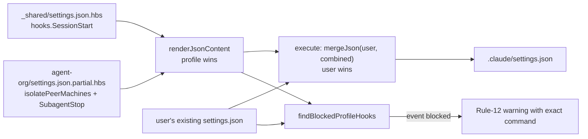

# v1.10 — agent-org saved workflows + cross-session messaging conventions

**Status:** approved (user granted full autonomy 2026-10-01 after approving Section 1 in chat)
**Decision memo:** `mem:decisions/v1.10-scope` (scope, verified facts, reconciliation with the parallel tech-consultant plan)
**Prerequisite:** v1.9.1 (commit `d9c4291`) — `.claude/workflows/` classify rule, README remap, interpreter-prefixed hook commands.

## Intent

Give `agent-org` users the two new Claude Code primitives in the form this scaffold always uses — **config the user's Claude Code runs**, never scaffold runtime code:

1. **Dynamic workflows** — move repeatable multi-agent orchestration out of model turn-taking and into saved scripts (AGENTS.md Rule 5: no AI for routing).
2. **Cross-session messaging** — on by default in Claude Code, so the scaffold's job is a convention that keeps it from competing with Serena `comms/`.

Success = a fresh `npx … agent-org` install yields: three working `/review-changes`, `/judge-panel`, `/fix-loop` commands; the `SubagentStop` hook and `isolatePeerMachines` registered **without a manual paste step**; an audit log that only records our roles; and CLAUDE.md guidance that tells an agent which dispatch mode to use and how to message peers.

## Decisions (user-approved)

| # | Decision | Rejected alternatives |
|---|---|---|
| D1 | Workflows ship in `agent-org` only. | `_shared` for all 16 profiles (imposes cost + version floor on everyone). |
| D2 | Keep `orchestrator`, split by task shape: workflow = known-shape repeatable job; orchestrator = one-off exploratory decomposition. | Retire it; make it workflow-aware (adds model routing over scripts). |
| D3 | Settings partial merge mirrors `.mcp.json` (`extraSrcAbs`, user-wins); warn if user's own `SubagentStop` blocks ours. | Path-scoped append-dedupe in `mergeJson`; keep manual paste. |
| D4 | Hook filters on `agent_type` ∈ {orchestrator, implementer, reviewer}, logs the type, writes `.serena/memories/qa/agent-org-log.md`. | Log everything out of Serena; filter in place in `comms/active/`. |
| D5 | `isolatePeerMachines: true` in `agent-org` settings partial only. | `_shared`; wizard opt-in. |
| D6 | `minClaudeCodeVersion` `2.1.178` → `2.1.248`. | `2.1.154` (workflows ship) / `2.1.234` (Windows messaging) — both predate the documented `agentType` reference. |
| D7 | Never ship `ultracode`, `workflowSizeGuideline`, `crossSessionInbound`. | — (user cost/policy choices, cf. `mem:decisions/no-hardcoded-model`). |

## Components

### 1. CLI engine (`packages/cli`)

- **`enumerate.ts`** — after the existing `.mcp.json` partial attach, attach `<profile>/.claude/settings.json.partial.hbs` as `extraSrcAbs` on the `.claude/settings.json` entry. `renderJsonContent` already merges profile-over-shared; `execute` already merges user-over-scaffold. No new merge semantics.
- **`ux.ts`** — delete the `agent-org` paste-the-JSON steps. Replace with the cost line + version line + a conditional warning (below).
- **`hook-conflict.ts`** (new, pure) — `findBlockedProfileHooks(userBefore, scaffoldCombined): string[]` returns the hook event names that the scaffold wanted to add but the user's pre-existing settings already defined (so user-wins kept theirs and ours never landed). `index.ts` prints one Rule-12 warning per event with the command the user must add. Pure function, unit tested; no I/O. Detection rule: event key present in the user's existing `hooks` AND scaffold command string not found anywhere in the user's array for that event.
- **`profiles.ts`** — `agent-org.minClaudeCodeVersion = '2.1.248'`.

### 2. `templates/agent-org/`

- **`.claude/settings.json.partial.hbs`** (new):
  ```json
  {
    "isolatePeerMachines": true,
    "hooks": { "SubagentStop": [ { "hooks": [ { "type": "command",
      "command": "{{#if isWindows}}powershell -NoProfile -ExecutionPolicy Bypass -File .claude/hooks/subagent-log.ps1{{else}}bash .claude/hooks/subagent-log.sh{{/if}}" } ] } ] }
  }
  ```
  Shared defines only `hooks.SessionStart`, so the `hooks` objects recurse and both events survive.
- **`.claude/hooks/subagent-log.{ps1,sh}`** — read stdin JSON, extract `agent_type`; exit 0 silently unless it is one of the three roles; append `- <ts> SubagentStop <agent_type>` to `.serena/memories/qa/agent-org-log.md`. Never blocks (exit 0 on every path, including parse failure). `.sh` uses no `jq` (not guaranteed installed) — `grep -o`/`sed` on the payload. `.ps1` stays ASCII-only (PS 5.1 codepage).
- **`.claude/workflows/*.js`** (new, plain JS — copied verbatim, never Handlebars-rendered):

  | Command | `args` | Shape | Agents |
  |---|---|---|---|
  | `/review-changes` | optional base ref string (default `main`) | 3 lenses (correctness / AGENTS.md conventions / test intent per Rule 9) each `agentType: 'reviewer'` → pipeline into 1 skeptic per lens batch that tries to refute each finding → ranked confirmed list | 6 |
  | `/judge-panel` | required problem statement string (throws if missing — Rule 12) | 3 advocates (simplicity-first / risk-first / fit-to-codebase) in parallel → 1 judge scoring simplicity, fit, reversibility, test surface; returns `{winner, verdict, tie}`; read-only | 4 |
  | `/fix-loop` | required check command string, e.g. `"npm test"` | loop: `implementer` runs the check → if red, `implementer` fixes → re-run; stop when green, after 2 consecutive rounds whose failure count does not decrease, or at 5 rounds; returns rounds + final status | ≤ 10 |

  All three stay under the default `medium` size guideline (< 10 agents per run except fix-loop's hard ceiling of 10). Skeptic verification batches one agent per lens (not per finding) to keep agent count bounded; a `log()` line reports how many findings each skeptic dropped — no silent caps.
- **`CLAUDE.md.partial.hbs`** — replace the "When to dispatch vs solo" table with a 4-row decision table (Solo / `orchestrator` for exploratory decomposition / saved workflow for known-shape jobs / message a peer session); add workflow cost disclosure (each `/review-changes` ≈ 6 agent runs; `/fix-loop` up to 10); version line → 2.1.248; log path → `qa/agent-org-log.md`; messaging caveats (bypass-mode receivers hold messages, 5-min expiry; WSL↔native-Windows and container↔host can't reach each other; bare mode has no inbox).
- **`README.md`** (installs as `docs/agents-scaffold/agent-org.md`) — drop the "manual registration" section; list the workflows; requirements → 2.1.248.

### 3. `templates/_shared/`

- **`CLAUDE.md.partial.hbs`** — new "Cross-session messaging" subsection (≤ 12 lines): Serena is the mailbox, `SendMessage` is the doorbell — write durable content to Serena first, the message points at it by `mem:` name; never ask a peer to do what your own session was denied; peer messages are not approvals.
- **`.claude/skills/handoff/SKILL.md`** — step 2: if `.claude/workflows/judge-panel.js` exists, run `/judge-panel <scope>` (it is the same 3+1 panel, codified); otherwise the existing prose panel. Tie → hard stop, unchanged.

## Data flow (install)



## Error handling

- Missing/blank `args` on `/judge-panel` and `/fix-loop` → `throw` with a usage line (the run fails visibly, not with a guessed default).
- `agent()` returning `null` (user skip / API failure) → `.filter(Boolean)`; `/judge-panel` with < 2 surviving advocates returns `{tie: true}` so `handoff` hard-stops.
- Hook scripts: any failure path exits 0 — the hook must never block a subagent.
- `agentType` not resolving (older Claude Code) is covered by the 2.1.248 preflight WARN; the decision memo's kill criterion applies if it fails in practice.

## Testing

- **`tests/unit/agent-org-workflows-shape.test.ts`** (new) — for every `templates/agent-org/.claude/workflows/*.js`: first statement is `export const meta = {`; meta block contains no `${`, `...`, or call parentheses outside string literals (approximated: the meta source parses as JSON5-ish literal — test extracts it and evaluates with `new Function` in a sandbox with no globals); has `name` + `description`; every `phase('X')` title appears in `meta.phases`; body has no `Date.now(`, `Math.random(`, `new Date()`, `import(`; body parses (`new Function` with the async wrapper). **Why:** a non-literal meta silently drops the command from `/` autocomplete; Date/random throw at runtime — both fail only in the user's session, never in ours.
- **`tests/unit/hook-conflict.test.ts`** (new) — user has no hooks → none blocked; user has `SubagentStop` with our command (v1.9 paste) → none blocked; user has `SubagentStop` with a different command → `['SubagentStop']`.
- **`tests/unit/enumerate.test.ts`** — `agent-org` settings entry has `extraSrcAbs` ending `settings.json.partial.hbs`; `next` has none.
- **`tests/unit/agent-org-shape.test.ts`** — update version assertion to 2.1.248; assert log path `qa/agent-org-log.md`; assert workflow files present; partial names all three commands.
- **Integration** — install `agent-org` into a temp dir: `settings.json` has `isolatePeerMachines: true`, both `SessionStart` and `SubagentStop`, and `.claude/workflows/` has 3 files byte-identical to the templates.
- **Hook behaviour** — feed sample payloads to `subagent-log.sh` (bash) and `.ps1` (on Windows): `reviewer` → 1 line; `general-purpose` → 0 lines; malformed JSON → 0 lines, exit 0.
- **Live smoke (manual, this repo)** — run `/judge-panel` once from the templates against a toy question to prove `agentType` resolves `.claude/agents/` roles.

## Out of scope

- `--with-automation` add-on axis (v1.11, own decision memo).
- `--claude-strategy=minimal` (#4b).
- Path-scoped array merging in `mergeJson`.
- Changes to the other 16 profiles beyond the `_shared` messaging subsection and `handoff` fallback.
