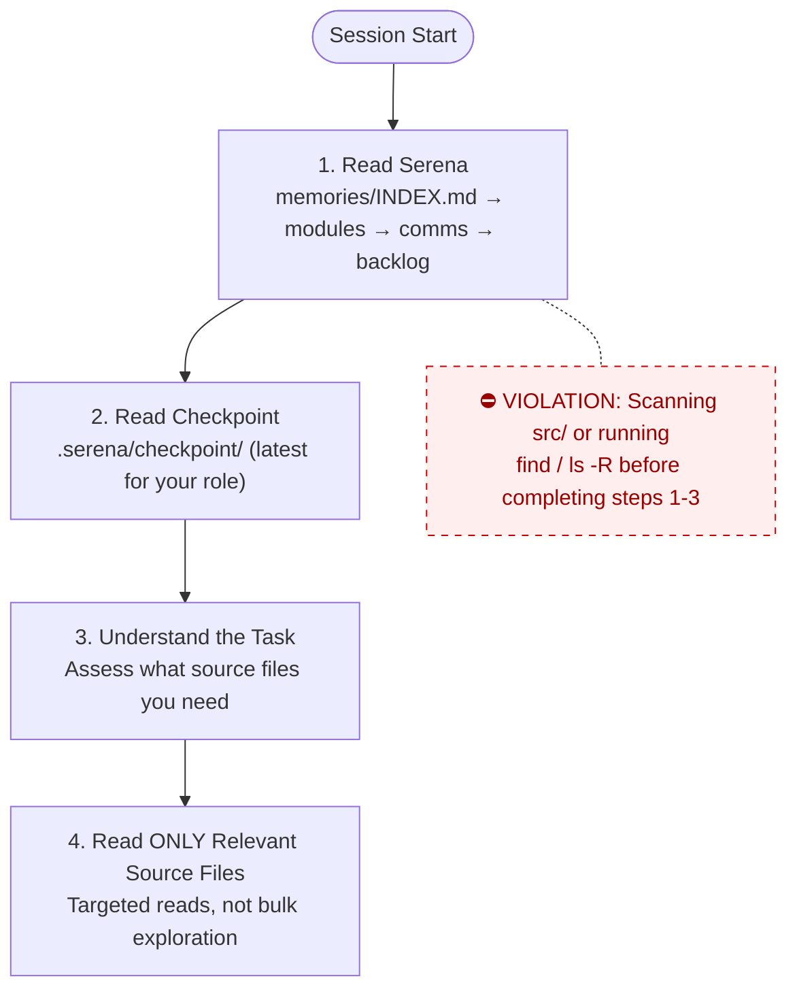
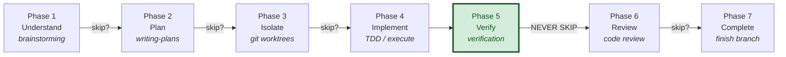
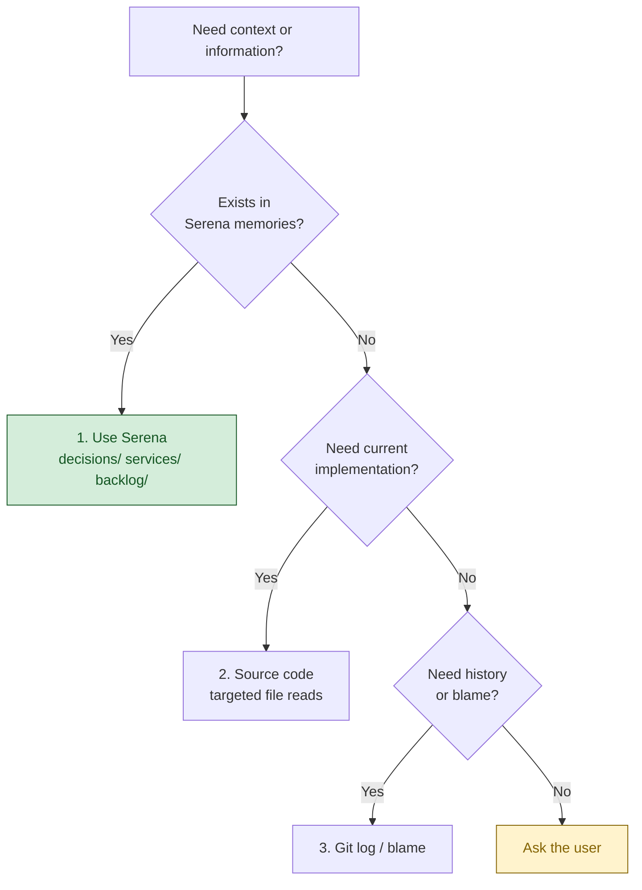
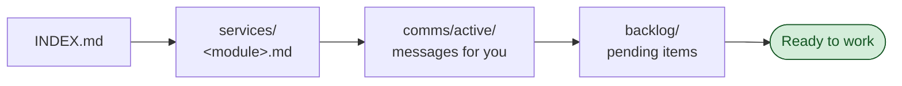
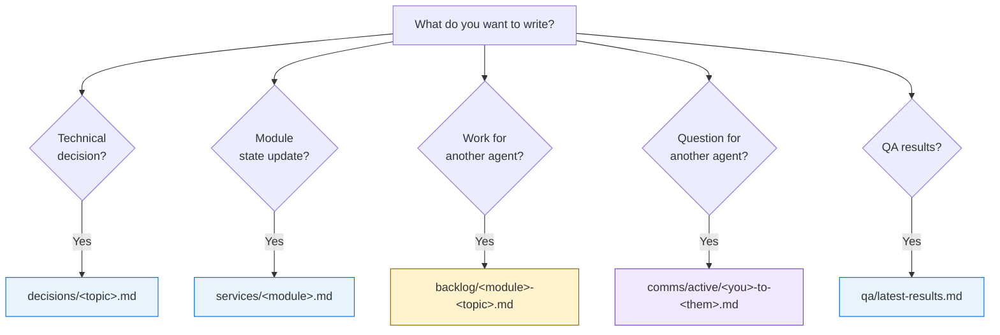

# CLAUDE.md

This file is the **ecosystem-level** guidance for Claude Code (claude.ai/code) and other AI agents working anywhere under `D:\Projects\NewEcoSystem` (NES). It governs the parent **orchestration root**. Each platform below also ships its own `CLAUDE.md` / `AGENTS.md` / `.serena/`, which is authoritative when you are working *inside* that platform; the **Workflow Rules** here apply ecosystem-wide on top of them.

## Project Overview

**NewEcoSystem (NES)** is the parent **orchestration root** that hosts several independent platforms plus the shared infrastructure that connects them. It is the home of the future **main orchestrator** — a central agent layer that collects monitoring, telemetry, and work signals from every platform (**AAAA**, **DAAB**, **LAAM**) and presents one cross-platform view.

Each platform is its **own git repository** — its own history, `CLAUDE.md`, `AGENTS.md`, `.serena/`, build, and deploy. NES is the *meta-root* over them: think **"polyrepo under one roof"**, not a monorepo with shared packages. The NES root itself has no `package.json`, no build, and no `.git`. The only runtime the platforms share today is **SharedContainers** (Postgres + Redis on the `ecosystem-net` Docker network).

| Folder | Platform | What it is |
|---|---|---|
| `AAAA/` | **AM AI Agent Assistant** | AI SaaS for the M&A industry — a "virtual investment banker" automating the deal lifecycle: document ingestion & analysis, Teaser/IM generation, valuation, and buyer–seller matching. (Its own docs also call it the "Asset & M&A Management AI Agent".) |
| `DAAB/` | **Digital AI Agent Brain** | The shared "brain" — the **Ennam Knowledge Graph Platform**, single source of truth for engineering. Human-authored knowledge + auto-extracted code knowledge, served to agents via **MCP** and to people via a web dashboard. |
| `LAAM/` | **Life AI Assistant Monitoring** | Real-time dashboard for local Claude agents (parsed from `~/.claude/projects` transcripts) + local chat assistant, durable workflows, and external connectors. (Its user-facing UI keeps the descriptive tagline "Local AI Agent Monitoring" — see note below.) |
| `SharedContainers/` | **Shared Ecosystem Infra** | Shared **Postgres (pgvector)** + **Redis** on the `ecosystem-net` network; multi-tenant DBs, one per platform. |

> **Codenames (authoritative):** `AAAA` = AM AI Agent Assistant · `DAAB` = Digital AI Agent Brain · `LAAM` = Life AI Assistant Monitoring. LAAM's in-repo docs (`CLAUDE.md` / `README.md`) use this canonical expansion; its **user-facing UI deliberately keeps the descriptive tagline "Local AI Agent Monitoring"** (en + vi/zh) because it markets what the product actually does — see `LAAM/.serena/memories/decisions/laam-name-expansion.md`. Don't "reconcile" that docs↔UI gap by reverting.

## The Orchestrator's Job

The main orchestrator that will live at this root plays a **CTO role** across the ecosystem. Its **primary input is each platform's `.serena/` memory store** — the same decisions / service-state / checkpoints / backlog / comms that every platform agent already writes per the Workflow Rules below. The orchestrator reads those memories to understand status, surface cross-platform risk, and direct work; it does **not** reach into another platform's source code.

**`.serena/` locations the orchestrator reads:**

| Platform | `.serena/` store(s) |
|---|---|
| **AAAA** | `AAAA/.serena/` |
| **DAAB** | `DAAB/.serena/` **plus one per sub-repo** — `DAAB/ennam.kg.go/.serena/`, `DAAB/ennam.kg.next/.serena/` (DAAB is multi-repo, so check them all) |
| **LAAM** | `LAAM/.serena/` |

Inside each store, the canonical reads are `memories/INDEX.md` → `decisions/` → `services/` → `backlog/` → `comms/`, and `.serena/checkpoint/` for the latest session checkpoints (see **Serena Memory Protocol** below for the exact layout).

**Secondary / runtime signals** each platform also emits (for live dashboards, once wired):

- **AAAA** — deal-pipeline signals: document-ingestion events, 6-step analysis metrics, KPI / red-flag extractions, buyer-persona scores, match proposals.
- **DAAB** — knowledge-graph & agent-compliance signals: node/edge creation, validation-gate pass rates, code-coverage / indexing status, AI-cost tracking, queue health.
- **LAAM** — live agent monitoring via SSE (`/api/events`), workflow-run events, audit-log mutations, connector activity.
- **SharedContainers** — infra health: container uptime, query performance, per-tenant DB growth, `ecosystem-net` connectivity, backup status.

## Platform Stacks

Each platform's own `CLAUDE.md` is authoritative for its internals — this is the high-level map only.

| Platform | Stack (high level) | Status |
|---|---|---|
| **AAAA** | Next.js 16 · React 19 · Prisma 7 / PostgreSQL 16 · Supabase Auth+Storage · Claude API (`@anthropic-ai/sdk`) · Inngest v4 · Tailwind 4 · shadcn/ui | v1.0.0 — through Phase 2B.2 (Buyer Persona); next: Phase 2C Matching Engine |
| **DAAB** | Go 1.25 (stdlib HTTP + MCP bridge) · Python 3.12 (FastAPI, tree-sitter indexers) · Next.js 16 (TanStack Query, Cytoscape.js) · PostgreSQL 16 + Apache AGE · Redis 7 · Claude Haiku 4.5 · AWS | Phase 1 ~99%; Phase 2 active |
| **LAAM** | Next.js 16 · React 19 · Drizzle / PostgreSQL 16 · Auth.js v5 (RBAC) · Ollama (local LLM) · SSE · MCP SDK | v2.4.1+ active |
| **SharedContainers** | Docker Compose · `pgvector/pgvector:pg16` · `redis:7-alpine` (pgvector, pg_trgm, uuid-ossp) | Stable; DAAB live, AAAA/LAAM provisioned (Phase 2) |

## Ecosystem Architecture

```
NewEcoSystem/                  ← orchestration root (this file governs here; no build/git of its own)
├── AAAA/                      ← AM AI Agent Assistant (own git repo · Next.js + Prisma + Supabase)
│   └── .serena/              ← memory store the orchestrator reads
├── DAAB/                      ← Digital AI Agent Brain (own git repo · Go + Python + Next.js)
│   ├── .serena/              ← top-level memory store
│   ├── ennam.kg.go/          ← REST API + MCP bridge  (has its own .serena/)
│   ├── ennam.kg.python/      ← code-indexing workers
│   ├── ennam.kg.next/        ← dashboard              (has its own .serena/)
│   └── ennam.kg.requirements/← formal BA docs
├── LAAM/                      ← Life AI Assistant Monitoring (own git repo · Next.js + Drizzle)
│   ├── .serena/              ← memory store the orchestrator reads
│   ├── collector/            ← zero-dep transcript pusher
│   └── host-agent/           ← legacy host driver
└── SharedContainers/          ← shared Postgres (pgvector) + Redis on ecosystem-net
    └── init-db/              ← per-tenant provisioning SQL
```

**Integration contract** (canonical: `SharedContainers/README.md`): apps reach the shared DB/cache by the stable DNS names `postgres` / `redis` over the external **`ecosystem-net`** Docker network. Tenancy: **DAAB → DB `ennam_kg`** (live); **AAAA / LAAM** → Phase 2 (provisioned placeholders). Redis multi-tenancy uses **key prefixes**, not logical DBs (matches ElastiCache cluster-mode db0-only). Cloud north star: RDS PostgreSQL (pgvector) + ElastiCache Redis; `ecosystem-net` → VPC + security groups.

## Working Across Platforms

Each platform is self-governing:

- It has its own `CLAUDE.md`, `AGENTS.md`, `.serena/` memories, and Session Boot / checkpoint conventions. **When working inside a platform, that platform's docs are authoritative** for stack, build, and conventions.
- Don't cross platform boundaries casually — they share no code, only the SharedContainers runtime. If two platforms must interact, do it through a **published interface** (HTTP API / DB tenant / MCP), and record the decision in the relevant platform's `.serena/`.
- Orchestrator work at this root should **consume** each platform's existing surface, never duplicate or fork its logic.

## Language Notes

The ecosystem is **Vietnamese-first**, with English (and 中文 in LAAM) available: AAAA uses `next-intl` (vi/en), LAAM uses an in-house provider (vi/en/zh, cookie `laam_lang`), and DAAB's BA docs are bilingual. When adding user-facing strings, follow the i18n convention of the platform you are in and cover **all** of its supported languages.

## Workflow Rules

@AGENTS.md

### Serena MCP Protocol (canonical — defines *how*; overrides file-path wording below)

**All `.serena/memories/` I/O goes through Serena MCP tools (`mcp__serena__*`). NEVER hand-edit memory files** with Read/Edit/Write — Serena indexes memories and resolves `` `mem:` `` links; hand-editing bypasses both. (Recorded global preference: `global/preferences/memory-system`.)

**Session start (before reading source):**
1. `mcp__serena__activate_project` for the target repo **by path** (`AAAA` / `DAAB` / `LAAM` / `NewEcoSystem` are NOT in the Serena registry → always activate by path) → `mcp__serena__initial_instructions` (loads the manual + lists available `global/*` memories).
2. `mcp__serena__read_memory`: `INDEX` → relevant `decisions/` / `services/` → **all `global/ecosystem/*`** (the cross-platform contract + per-platform plans) → `comms/active/` → `backlog/` → latest `checkpoint/`.

**Writing:** `mcp__serena__write_memory(name, content)` — names use `/` topics (`decisions/…`, `services/…`, `backlog/…`, `comms/active/…`, `qa/…`, `checkpoint/…`); link memories as `` `mem:<name>` ``. Use `mcp__serena__edit_memory` for targeted edits and `mcp__serena__delete_memory` when an item is done.

**Checkpoint (end of EVERY session):** `mcp__serena__write_memory("checkpoint/<agent-name>-<YYYY-MM-DD>", …)`.

**Ecosystem (the orchestrator OWNS this):** the orchestrator **writes** Serena **`global/ecosystem/*`** — the shared contract + per-platform plans, the only Serena channel readable by every platform. Read each platform's own store by **path-activating** it; never reach into another platform's source. Keep THIS repo's project store to orchestrator-private items (INDEX + checkpoints).

> The subsections below (Session Boot / Knowledge Source / Serena Memory Protocol / checkpoint) remain the reference for *what* to read/write and *where things go*; **this block is authoritative for *how*** — always via Serena MCP, checkpoints under `memories/checkpoint/`, ecosystem coordination via `global/ecosystem/*`.

### Session Boot Protocol

**Every agent MUST follow this exact sequence at session start.**
DO NOT read source code, explore directories, or scan the codebase
until you have completed steps 1-3. Source code is a last resort,
not a starting point.

1. **Read Serena** — `memories/INDEX.md` → relevant module memories → `comms/active/` → `backlog/`
2. **Read checkpoint** — `.serena/checkpoint/` for the most recent checkpoint from your role
3. **Understand the task** — you now have project context. Only NOW assess what source files you need.
4. **Read ONLY the source files relevant to your task** — targeted reads, not bulk exploration.



**Violations**: Scanning `src/`, or running `find` / `ls -R` at session start before completing steps 1-3 is a protocol violation. It wastes tokens and ignores existing knowledge.

### Superpowers Workflow

Every agent session follows this structured workflow.
Phases may be skipped for trivial tasks (< 3 steps, single file, obvious fix).
When skipping, state which phases you're skipping and why.

#### Phase 1 — Understand
**Skill**: `superpowers:brainstorming`
**When**: Creating features, modifying behavior, adding functionality.
**Skip if**: Bug fix with clear reproduction, typo, config change.
**Output**: Approved design in `docs/superpowers/specs/`

#### Phase 2 — Plan
**Skill**: `superpowers:writing-plans`
**When**: Task requires 3+ steps or touches multiple files/services.
**Skip if**: Single-file change with obvious implementation.
**Output**: Implementation plan with success criteria per step.

#### Phase 3 — Isolate
**Skill**: `superpowers:using-git-worktrees`
**When**: Feature work that should not pollute the working branch.
**Skip if**: Hotfix, docs-only change, or user requests in-place work.
**Output**: Isolated worktree or branch ready for implementation.

#### Phase 4 — Implement
**Skills** (use as needed):
- `superpowers:test-driven-development` — write tests first, then implementation
- `superpowers:executing-plans` — execute the plan from Phase 2
- `superpowers:dispatching-parallel-agents` — 2+ independent tasks
- `superpowers:subagent-driven-development` — delegate to specialized agents
- `superpowers:systematic-debugging` — when encountering failures during implementation
**Output**: Working code with tests.

#### Phase 5 — Verify
**Skill**: `superpowers:verification-before-completion`
**When**: ALWAYS. This phase is never skipped.
**Output**: Evidence that success criteria are met (test output, build output).

#### Phase 6 — Review
**Skill**: `superpowers:requesting-code-review`
**When**: Feature work, significant changes, anything touching shared code.
**Skip if**: Docs-only, config-only, or user explicitly waives review.
**Output**: Review feedback addressed.

#### Phase 7 — Complete
**Skill**: `superpowers:finishing-a-development-branch`
**When**: Implementation verified and reviewed.
**Output**: PR created, branch merged, or completion option presented to user.

#### Workflow Diagram



#### On-Demand Skills (any phase)
- `superpowers:systematic-debugging` — when hitting unexpected failures
- `superpowers:receiving-code-review` — when receiving feedback from others
- `superpowers:writing-skills` — when creating/modifying workflow skills

### Task Complexity Guide

| Complexity | Example | Required Phases |
|-----------|---------|-----------------|
| **Trivial** | Fix typo, update config value | Implement → Verify |
| **Simple** | Single-file bug fix, add field | Plan → Implement → Verify |
| **Medium** | New endpoint, new component | Plan → Implement → Verify → Review |
| **Complex** | New feature across services | ALL phases |

### Knowledge Source Priority

Agents MUST consult existing knowledge before exploring source code.

#### Retrieval order (strict)



1. **Serena memories** — primary source for decisions, architecture context, conventions, and inter-agent communication
2. **Source code / git log** — when you need exact current implementation details

#### When to read from Serena

| Moment | Action |
|--------|--------|
| Session start | Read `memories/INDEX.md` — understand what's been decided, what's in progress |
| Before coding a function | Check `services/<module>.md` — check related decisions and conventions |
| Before making a design decision | Search `decisions/` — check for prior decisions on same topic |
| When encountering unfamiliar code | Check memories — there may be a decision or discovery explaining it |

#### When to write to Serena

| Moment | Action |
|--------|--------|
| After making a design decision | Write to `memories/decisions/<topic>.md` |
| After discovering something non-obvious | Write to `memories/decisions/<topic>.md` |
| After completing a task | Update checkpoint + relevant service memory |
| When identifying work for another agent | Write to `memories/backlog/<service>-<topic>.md` |

### Mandatory Session Checkpoint

**All AI agents MUST write a checkpoint at the end of every session — via Serena MCP** (`mcp__serena__write_memory`).

**Format**: `mcp__serena__write_memory("checkpoint/<agent-name>-<YYYY-MM-DD>", …)` → stored at `.serena/memories/checkpoint/<agent-name>-<YYYY-MM-DD>.md`. Write through Serena MCP, **never** by hand-editing the file. (Supersedes the old `.serena/checkpoint/` path.)

**Required content**:
```markdown
# Checkpoint: <agent-name> — <date>

## What was done
- <bullet list of completed work>

## Files changed
- <list of files created/modified/deleted>

## Current state
- <what is working, what is broken, what is partially done>

## Next steps
- <what the next session should pick up>

## Blockers / Risks
- <anything that could block progress>
```

**Rules**:
- Write checkpoint BEFORE ending the session — no exceptions
- If the session was interrupted or failed, still write a checkpoint noting the failure
- One file per agent per day; append if multiple sessions in the same day
- Keep each checkpoint concise (under 50 lines)
- This applies to ALL agents: any subagents, specialized agents, or the main session agent

### Serena Memory Protocol

Serena is the project's knowledge store for decisions, conventions, service state, and inter-agent communication.
All agents MUST follow these rules when reading/writing to `.serena/memories/`.

#### Read Protocol — Session Start



1. Read `memories/INDEX.md` first
2. Read `services/<your-module>.md` for current state
3. Check `comms/active/` for messages addressed to you
4. Check `backlog/` for pending action items in your domain

#### Write Protocol — What goes where



| You want to... | Write to | Naming |
|----------------|----------|--------|
| Record a technical decision | `decisions/<topic>.md` | Descriptive topic name |
| Update module/service state | `services/<module>.md` | Append or replace section |
| Flag work for another agent | `backlog/<module>-<topic>.md` | Prefix with target module |
| Ask another agent a question | `comms/active/<you>-to-<them>-<topic>.md` | |
| Respond to a question | Append to the existing file in `comms/active/` | |
| Close a resolved thread | Move both files to `comms/resolved/` | |
| Report QA results | `qa/latest-results.md` (replace) | Keep only latest |
| Store something historical | `archive/<category>/` | |

#### Rules

- **Never create new top-level directories** under `memories/`
- **Never put files directly in `memories/`** — always in a subdirectory
- **1 file per module** in `services/` — update, don't create siblings
- **Backlog items**: delete the file when the work is done
- **Comms**: respond within the SAME file (append), don't create
  a separate response file. Move to `resolved/` when done.
- **Decisions**: only for choices that affect future work. Don't store
  implementation details — those belong in code comments.
- **Update INDEX.md** when adding new files to `decisions/` or `services/`
- **QA**: `latest-results.md` is overwritten each run. Archive old
  results to `archive/qa-runs/<date>.md` before overwriting.

## Documentation

Each platform owns its canonical docs — `README.md` (often **Vietnamese**) and `CHANGELOG.md` (Keep a Changelog + SemVer) live **inside the platform folder**; keep those in sync there. `SharedContainers/README.md` is the canonical infra reference. At this root, document **cross-platform** concerns (orchestrator design, integration contracts) and update this file whenever the set of platforms or the shared-infra contract changes.

## Build & Run Commands

There is **no single build at this root** — each platform builds and runs independently. Bring up the shared infra first, then the platform(s) you need; always defer to each platform's own `CLAUDE.md` / `README.md` for exact commands.

```bash
# 1) Shared infra (once) — Postgres (pgvector) + Redis on ecosystem-net
cd SharedContainers
cp .env.example .env                    # set INFRA_PG_PASSWORD
docker network create ecosystem-net     # once; shared by all platform stacks
docker compose up -d                    # postgres :5500→5432, redis :6379

# 2) A platform — follow ITS docs. Next.js platforms (AAAA, LAAM) look like:
cd ../LAAM                              # or ../AAAA
cp .env.example .env
npm ci
npm run db:migrate                      # LAAM: Drizzle  ·  AAAA: npx prisma migrate
npm run dev

# DAAB is multi-stack — see DAAB/CLAUDE.md (Go: make · Python: uv · Next: npm)
```

DBs use **migrations**, never push-to-prod schema changes. Each Next.js platform pins **Next.js 16** with breaking changes vs. older releases — read its in-repo guidance before writing code.
