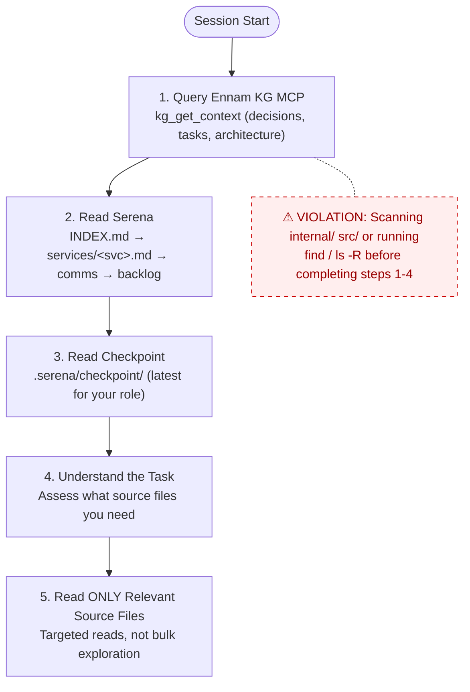
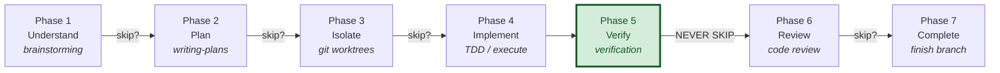
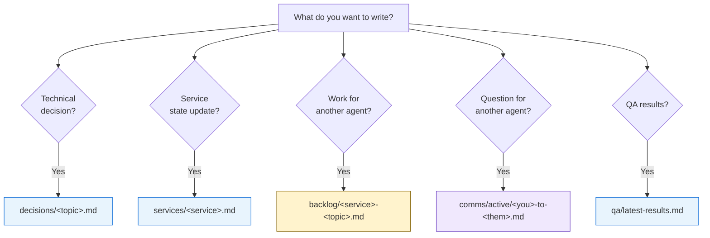

# Ennam Knowledge Graph Platform

## Project Overview
AWS-hosted Knowledge Graph platform — single source of truth for all Ennam engineering projects.
Combines human-driven project knowledge with auto-extracted code knowledge, accessible via MCP and web dashboard.

## Sub-Projects
| Repo | Purpose | Status |
|------|---------|--------|
| `ennam.kg.go/` | Go API server + MCP bridge | ~99% Phase 1 |
| `ennam.kg.python/` | Python indexing workers | All sprints done |
| `ennam.kg.next/` | NextJS web dashboard | All sprints done |
| `ennam.kg.requirements/` | Formal BA documentation | 6 BA docs, 208 acceptance criteria |

## Documentation
- **Formal requirements**: `ennam.kg.requirements/documents/phase1/BA-001` through `BA-006`
- **Design spec (original)**: `2026-03-23-ennam-knowledge-graph-platform-design.md`
- **Serena memories (operational)**: `.serena/memories/` — agent notes, checkpoints, conventions
- **Per-service docs**: Each sub-project has its own `CLAUDE.md` and `README.md`

## Tech Stack

| Sub-Project | Language / Runtime | Key Frameworks & Libraries | Tooling |
|-------------|--------------------|----------------------------|---------|
| `ennam.kg.go` | Go (stdlib `net/http`, no framework) | `database/sql` (no ORM), golang-migrate, gorilla/websocket, `log/slog`, AES-256-GCM | `make`, golangci-lint, `go test -race` |
| `ennam.kg.python` | Python 3.12 | FastAPI, uvicorn, httpx, pydantic-settings, redis, anthropic (Haiku 4.5), tree-sitter (TS/Python) | `uv`, ruff, pytest |
| `ennam.kg.next` | TypeScript (strict) / Node | NextJS 16 App Router, React 19, TanStack Query, iron-session, Cytoscape.js, shadcn/ui, Tailwind 4 | npm, ESLint |
| `ennam.kg.requirements` | Markdown (docs-only) | Mermaid diagrams, Gherkin acceptance criteria | — (no build) |
| Shared infra | — | PostgreSQL 16 (pgvector), Redis 7 | Docker Compose |

## Build & Run

**Full stack (Docker — for integration testing):**

| Command | Description |
|---------|-------------|
| `docker compose up -d` | Start all 6 services (postgres, redis, kg-server, indexer, worker, dashboard) |
| `docker compose up -d --build` | Rebuild images and start |
| `docker compose logs -f [service]` | Follow logs (all, or one service) |
| `docker compose ps` | Service status |
| `docker compose down [-v]` | Stop all (`-v` also drops the postgres volume) |

Endpoints: Go API `http://localhost:8080` · Python indexer `http://localhost:8081` · Dashboard `http://localhost:3500`

**Per-service local dev (single service against Dockerized deps):**

| Service | Common commands |
|---------|-----------------|
| `ennam.kg.go` | `make dev` · `make build` · `make test` · `make lint` · `go run ./cmd/kg-server/` |
| `ennam.kg.python` | `uv sync` · `uv run uvicorn ennam_kg.main:app --reload --port 8081` · `uv run python -m ennam_kg.worker` · `uv run pytest` |
| `ennam.kg.next` | `npm run dev` · `npm run build` · `npm run start` · `npm run lint` |

> Each sub-project's `CLAUDE.md` has the full command reference.

## Workflow Rules

@AGENTS.md

### Serena MCP Protocol (canonical — defines *how*; overrides file-path wording below)

**All `.serena/memories/` I/O goes through Serena MCP tools (`mcp__serena__*`). NEVER hand-edit memory files** with Read/Edit/Write — Serena indexes memories and resolves `` `mem:` `` links; hand-editing bypasses both. (Recorded global preference: `global/preferences/memory-system`.)

**Session start (before reading source):** keep the **Ennam KG MCP** query (step 1 of the Session Boot Protocol below) for project knowledge — AND load Serena memories via MCP:
1. `mcp__serena__activate_project` for this repo **by path** (it is not in the Serena registry) → `mcp__serena__initial_instructions` (loads the manual + lists available `global/*` memories).
2. `mcp__serena__read_memory`: `INDEX` → relevant `decisions/` / `services/` → **`global/ecosystem/shared-memory-contract`** + **`global/ecosystem/daab-plan`** (ecosystem context for DAAB) → `comms/active/` → `backlog/` → latest `checkpoint/`.

**Writing:** `mcp__serena__write_memory(name, content)` — names use `/` topics (`decisions/…`, `services/…`, `backlog/…`, `comms/active/…`, `qa/…`, `checkpoint/…`); link memories as `` `mem:<name>` ``. Use `mcp__serena__edit_memory` for targeted edits and `mcp__serena__delete_memory` when an item is done.

**Checkpoint (end of EVERY session):** `mcp__serena__write_memory("checkpoint/<agent-name>-<YYYY-MM-DD>", …)`.

**Ecosystem (cross-platform):** shared knowledge lives in Serena **`global/ecosystem/*`** — the only channel readable across platforms. **READ** it for context (`global/ecosystem/daab-plan` is DAAB's keystone-owner slice). The **NewEcoSystem orchestrator owns/writes** it. ⚠️ This Serena *global* store is DISTINCT from DAAB's own `kg_*` memory **product** (`kg_remember`/`kg_recall`, the shared-memory substrate DAAB builds for AAAA/LAAM): as a platform, DAAB **reads** `global/ecosystem/*` and does not write there.

> The subsections below (Session Boot / Knowledge Source / Serena Memory Protocol / checkpoint) remain the reference for *what* to read/write and *where things go*; **this block is authoritative for *how*** — always via Serena MCP, checkpoints under `memories/checkpoint/`, ecosystem context via `global/ecosystem/*`. DAAB's KG-first step 1 stays.

### Session Boot Protocol

**Every agent MUST follow this exact sequence at session start.**
DO NOT read source code, explore directories, or scan the codebase
until you have completed steps 1-4. Source code is a last resort,
not a starting point.

1. **Query Ennam KG MCP** — `kg_get_context` for decisions, tasks, architecture relevant to your assignment. If KG MCP is unavailable, note the failure and proceed to step 2.
2. **Read Serena** — `memories/INDEX.md` → `services/<your-service>.md` → `comms/active/` → `backlog/`
3. **Read checkpoint** — `.serena/checkpoint/` for the most recent checkpoint from your role
4. **Understand the task** — you now have project context. Only NOW assess what source files you need.
5. **Read ONLY the source files relevant to your task** — targeted reads, not bulk exploration.



**Violations**: Scanning `internal/`, `src/`, or running `find` / `ls -R` at session start before completing steps 1-4 is a protocol violation. It wastes tokens and ignores existing knowledge.

### Superpowers Workflow

Every agent session follows this structured workflow.
Phases may be skipped for trivial tasks (< 3 steps, single file, obvious fix).
When skipping, state which phases you're skipping and why.

#### Phase 1 — Understand
**Skill**: `superpowers:brainstorming`
**When**: Creating features, modifying behavior, adding functionality.
**Skip if**: Bug fix with clear reproduction, typo, config change.
**Output**: Approved design in `docs/superpowers/specs/`

#### Phase 2 — Plan
**Skill**: `superpowers:writing-plans`
**When**: Task requires 3+ steps or touches multiple files/services.
**Skip if**: Single-file change with obvious implementation.
**Output**: Implementation plan with success criteria per step.

#### Phase 3 — Isolate
**Skill**: `superpowers:using-git-worktrees`
**When**: Feature work that should not pollute the working branch.
**Skip if**: Hotfix, docs-only change, or user requests in-place work.
**Output**: Isolated worktree or branch ready for implementation.

#### Phase 4 — Implement
**Skills** (use as needed):
- `superpowers:test-driven-development` — write tests first, then implementation
- `superpowers:executing-plans` — execute the plan from Phase 2
- `superpowers:dispatching-parallel-agents` — 2+ independent tasks
- `superpowers:subagent-driven-development` — delegate to specialized agents
- `superpowers:systematic-debugging` — when encountering failures during implementation
**Output**: Working code with tests.

#### Phase 5 — Verify
**Skill**: `superpowers:verification-before-completion`
**When**: ALWAYS. This phase is never skipped.
**Output**: Evidence that success criteria are met (test output, build output).

#### Phase 6 — Review
**Skill**: `superpowers:requesting-code-review`
**When**: Feature work, significant changes, anything touching shared code.
**Skip if**: Docs-only, config-only, or user explicitly waives review.
**Output**: Review feedback addressed.

#### Phase 7 — Complete
**Skill**: `superpowers:finishing-a-development-branch`
**When**: Implementation verified and reviewed.
**Output**: PR created, branch merged, or completion option presented to user.

#### Workflow Diagram



#### On-Demand Skills (any phase)
- `superpowers:systematic-debugging` — when hitting unexpected failures
- `superpowers:receiving-code-review` — when receiving feedback from others
- `superpowers:writing-skills` — when creating/modifying workflow skills

### Task Complexity Guide

| Complexity | Example | Required Phases |
|-----------|---------|-----------------|
| **Trivial** | Fix typo, update config value | Implement → Verify |
| **Simple** | Single-file bug fix, add field | Plan → Implement → Verify |
| **Medium** | New endpoint, new component | Plan → Implement → Verify → Review |
| **Complex** | New feature across services | ALL phases |

### Knowledge Source Priority

Agents MUST use the Ennam KG MCP server as the PRIMARY source for
context retrieval during all phases. This is the project's own
knowledge graph — use it.

#### Retrieval order (strict)

1. **Ennam KG MCP** — query first for decisions, architecture,
   function context, requirements, discoveries, task history
2. **Serena memories** — fallback when KG MCP is down or data
   not yet stored
3. **Source code / git log** — last resort, or when you need
   exact current implementation details

#### When to query KG

| Moment | Action |
|--------|--------|
| Session start | `kg_get_context` — understand what's been decided, what's in progress |
| Before coding a function | `kg_get_function_context` — check related nodes, edges, decisions |
| Before making a design decision | `kg_query` — search for prior decisions on same topic |
| When encountering unfamiliar code | `kg_query` — check if there's a discovery or architecture node explaining it |

#### When to write back to KG

| Moment | Action |
|--------|--------|
| After making a design decision | `kg_store_decision` |
| After discovering something non-obvious | `kg_store_discovery` |
| After defining a new concept | `kg_store_concept` |
| After completing a task | `kg_store_task` (with status) |

#### Fallback behavior

If KG MCP is unreachable:
1. Log the failure (don't silently skip)
2. Fall back to Serena memories (`.serena/memories/`)
3. Note in checkpoint that KG was unavailable — data needs backfill

### Mandatory Session Checkpoint

**All AI agents MUST write a checkpoint at the end of every session — via Serena MCP** (`mcp__serena__write_memory`).

**Format**: `mcp__serena__write_memory("checkpoint/<agent-name>-<YYYY-MM-DD>", …)` → stored at `.serena/memories/checkpoint/<agent-name>-<YYYY-MM-DD>.md`. Write through Serena MCP, **never** by hand-editing the file. (Supersedes the old `.serena/checkpoint/` path.)

**Required content**:
```markdown
# Checkpoint: <agent-name> — <date>

## What was done
- <bullet list of completed work>

## Files changed
- <list of files created/modified/deleted>

## Current state
- <what is working, what is broken, what is partially done>

## Next steps
- <what the next session should pick up>

## Blockers / Risks
- <anything that could block progress>
```

**Rules**:
- Write checkpoint BEFORE ending the session — no exceptions
- If the session was interrupted or failed, still write a checkpoint noting the failure
- One file per agent per day; append if multiple sessions in the same day
- Keep each checkpoint concise (under 50 lines)
- This applies to ALL agents: project-owner, team-lead, backend-dev, web-dev, mobile-dev, test-worker, reviewer, and any subagents

### Serena Memory Protocol

Serena is the interim knowledge store until Ennam KG MCP is fully operational.
All agents MUST follow these rules when reading/writing to `.serena/memories/`.

#### Read Protocol — Session Start
1. Read `memories/INDEX.md` first
2. Read `services/<your-service>.md` for current state
3. Check `comms/active/` for messages addressed to you
4. Check `backlog/` for pending action items in your domain


#### Write Protocol — What goes where

| You want to... | Write to | Naming |
|----------------|----------|--------|
| Record a technical decision | `decisions/<topic>.md` | Descriptive topic name |
| Update service state | `services/<service>.md` | Append or replace section |
| Flag work for another agent | `backlog/<service>-<topic>.md` | Prefix with target service |
| Ask another agent a question | `comms/active/<you>-to-<them>-<topic>.md` | |
| Respond to a question | Append to the existing file in `comms/active/` | |
| Close a resolved thread | Move both files to `comms/resolved/` | |
| Report QA results | `qa/latest-results.md` (replace) | Keep only latest |
| Store something historical | `archive/<category>/` | |



#### Rules

- **Never create new top-level directories** under `memories/`
- **Never put files directly in `memories/`** — always in a subdirectory
- **1 file per service** in `services/` — update, don't create siblings
- **Backlog items**: delete the file when the work is done
- **Comms**: respond within the SAME file (append), don't create
  a separate response file. Move to `resolved/` when done.
- **Decisions**: only for choices that affect future work. Don't store
  implementation details — those belong in code comments or KG.
- **Update INDEX.md** when adding new files to `decisions/` or `services/`
- **QA**: `latest-results.md` is overwritten each run. Archive old
  results to `archive/qa-runs/<date>.md` before overwriting.
