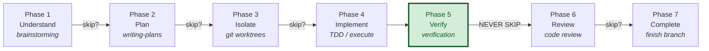

### Superpowers Workflow

Every agent session follows this structured workflow.
Phases may be skipped for trivial tasks (< 3 steps, single file, obvious fix).
When skipping, state which phases you're skipping and why.

#### Phase 1 — Understand
**Skill**: `superpowers:brainstorming`
**When**: Creating features, modifying behavior, adding functionality.
**Skip if**: Bug fix with clear reproduction, typo, config change.
**Output**: Approved design in `docs/superpowers/specs/`

#### Phase 2 — Plan
**Skill**: `superpowers:writing-plans`
**When**: Task requires 3+ steps or touches multiple files/services.
**Skip if**: Single-file change with obvious implementation.
**Output**: Implementation plan with success criteria per step.

#### Phase 3 — Isolate
**Skill**: `superpowers:using-git-worktrees`
**When**: Feature work that should not pollute the working branch.
**Skip if**: Hotfix, docs-only change, or user requests in-place work.
**Output**: Isolated worktree or branch ready for implementation.

#### Phase 4 — Implement
**Skills** (use as needed):
- `superpowers:test-driven-development` — write tests first, then implementation
- `superpowers:executing-plans` — execute the plan from Phase 2
- `superpowers:dispatching-parallel-agents` — 2+ independent tasks
- `superpowers:subagent-driven-development` — delegate to specialized agents
- `superpowers:systematic-debugging` — when encountering failures during implementation
**Output**: Working code with tests.

#### Phase 5 — Verify
**Skill**: `superpowers:verification-before-completion`
**When**: ALWAYS. This phase is never skipped.
**Output**: Evidence that success criteria are met (test output, build output).

#### Phase 6 — Review
**Skill**: `superpowers:requesting-code-review`
**When**: Feature work, significant changes, anything touching shared code.
**Skip if**: Docs-only, config-only, or user explicitly waives review.
**Output**: Review feedback addressed.

#### Phase 7 — Complete
**Skill**: `superpowers:finishing-a-development-branch`
**When**: Implementation verified and reviewed.
**Output**: PR created, branch merged, or completion option presented to user.

#### Workflow Diagram

#### On-Demand Skills (any phase)
- `superpowers:systematic-debugging` — when hitting unexpected failures
- `superpowers:receiving-code-review` — when receiving feedback from others
- `superpowers:writing-skills` — when creating/modifying workflow skills

### Task Complexity Guide

| Complexity | Example | Required Phases |
|-----------|---------|-----------------|
| **Trivial** | Fix typo, update config value | Implement → Verify |
| **Simple** | Single-file bug fix, add field | Plan → Implement → Verify |
| **Medium** | New endpoint, new component | Plan → Implement → Verify → Review |
| **Complex** | New feature across services | ALL phases |
